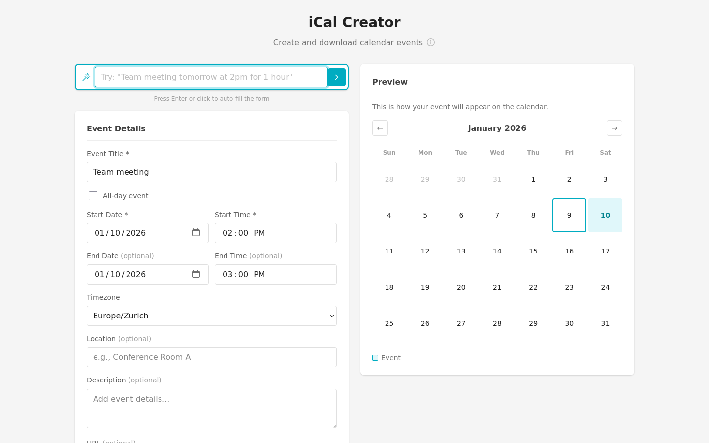
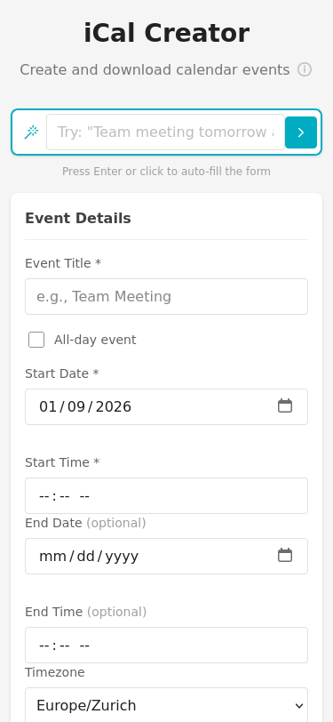

# Natural Language Event Input

## Description
Add a text field that parses natural language like "Team meeting tomorrow at 3pm for 1 hour" and fills the form automatically.

## User Value
- **Speed**: Type once, fill many fields
- **Intuitive**: Express events naturally
- **Power users**: Fast event creation

## Implementation Details
- Add "Quick Add" text input at top
- Parse common patterns:
  - "Meeting tomorrow at 2pm"
  - "Lunch with John on Friday at noon"
  - "Weekly standup every Monday 9am"
- Use regex or simple NLP
- Fill form fields from parsed data
- User can review/edit before saving

## Planning Decisions

### Start Timestamp
2026-01-09 01:52:00

### Implementation Plan
1. Add "Quick Add" input field at top of form with magic wand icon
2. Create parseNaturalLanguage() function using regex patterns
3. Parse common date references: today, tomorrow, next [day], [day name]
4. Parse time references: at [time], [time]pm/am, noon, midnight
5. Parse duration: for [n] hour(s)/minute(s)
6. Parse recurrence: every [day], weekly, daily, monthly
7. Extract title from remaining text
8. Fill form fields and trigger relevant UI updates
9. Write Playwright tests for parsing

### Assumptions
- Will use pure JavaScript regex, no external NLP library
- Focus on English language patterns only
- Title will be whatever text remains after extracting date/time/recurrence
- User pressed Enter or clicks button to parse and fill form
- Show parsed result in input as placeholder/hint

### End Timestamp
2026-01-09 01:48:00

### Duration
~56 minutes (planning and implementation)

## Screenshots

### Desktop View

### Desktop View (After Parsing)

### Mobile View

