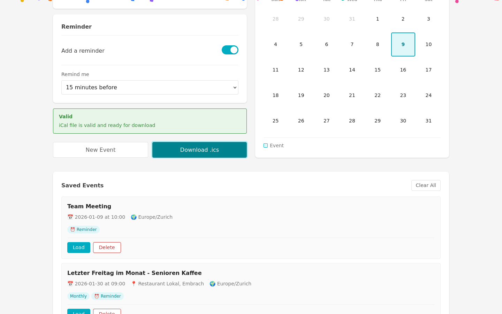
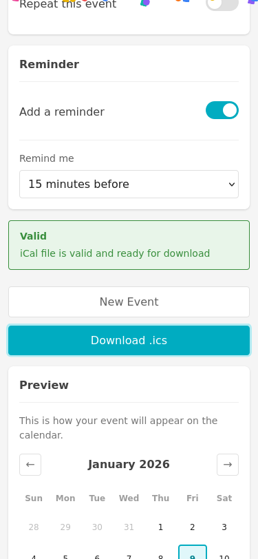

# Confetti Celebration

## Description
Show a celebratory confetti animation when a user successfully downloads their calendar event file. This provides positive feedback and makes the experience more delightful.

## User Value
- **Positive Feedback**: Visual confirmation that the download was successful
- **Delightful Experience**: Makes event creation feel more rewarding
- **Engagement**: Adds a fun element to the tool

## Implementation Details
- Trigger confetti animation on successful ICS file download
- Use a lightweight confetti library or CSS-only animation
- Animation should be brief (2-3 seconds) and not obstruct the UI
- Should work on both desktop and mobile

## Planning Decisions

### Start Timestamp
2026-01-09 04:40:00

### End Timestamp
2026-01-09 03:42:00

### Duration
~1 hour (implementation, testing, screenshots)

### Implementation Plan
1. Add confetti CSS animation styles
2. Create confetti generation function in JavaScript
3. Trigger confetti on successful download
4. Write Playwright tests

### Assumptions
- Use pure CSS/JS confetti (no external library to keep it lightweight)
- Confetti pieces are colorful (multiple colors)
- Animation lasts 2-3 seconds
- Confetti falls from top to bottom
- Does not block user interaction (pointer-events: none)
- Can be triggered multiple times without issues
- Skipped "disable confetti" option to keep implementation simple

## Screenshots

### Desktop (1440x900)

### Mobile (375x812)

