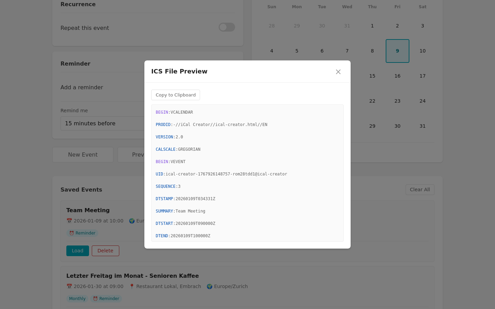
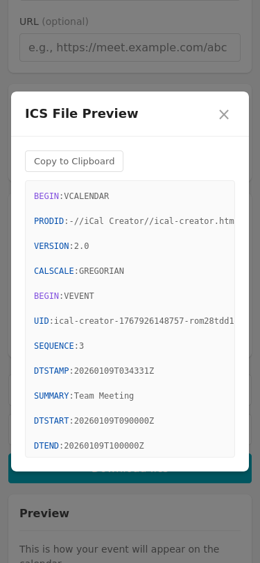

# ICS File Preview

## Description
Show a preview of the raw ICS file content before downloading. This helps users understand what data will be included in their calendar event file and verify the content is correct.

## User Value
- **Transparency**: Users can see exactly what's in the ICS file before downloading
- **Verification**: Users can verify event details are correctly formatted
- **Debugging**: Helps troubleshoot issues with calendar imports
- **Learning**: Users can understand the ICS file format

## Implementation Details
- Add a "Preview ICS" button or expandable section
- Display the raw ICS content in a formatted/syntax-highlighted view
- Show content in a modal or collapsible panel
- Include copy-to-clipboard functionality
- Format should be readable with line breaks preserved

## Planning Decisions

### Start Timestamp
2026-01-09 03:45:00

### Implementation Plan
1. Add UI element to show/hide ICS preview (modal or collapsible)
2. Generate ICS content and display in preview
3. Add syntax highlighting for ICS format
4. Add copy-to-clipboard button
5. Write Playwright tests

### Assumptions
- Preview will be shown in a modal dialog for cleaner UX
- Use a monospace font for the ICS content
- Add basic syntax highlighting (property names in different color)
- Copy button should show confirmation when clicked
- Preview can be accessed before downloading

### End Timestamp
2026-01-09 03:50:00

### Duration
~5 minutes (implementation, testing, screenshots)

## Screenshots

### Desktop (1440x900)

### Mobile (375x812)

